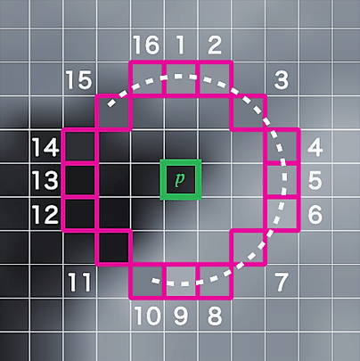

# Features from Accelerated Segment Test (FAST) for keypoints detection

Implementation based on this [paper](https://homepages.inf.ed.ac.uk/rbf/CVonline/LOCAL_COPIES/AV1011/AV1FeaturefromAcceleratedSegmentTest.pdf)

Principle:

* For a pixel p with intensity Ip, a circle of 16 pixels surrounding the pixel p is considered (Bresenham circle of radius 3):

* Given a threshold T, if N pixels (among the 16) are either above or below Ip plus or minus T, p is an interest point (N=12 in the first version of the algorithm)

* To accelerate the computation, first compare the intensity of pixels (1, 5, 9, 13) and compute the others afterwards only if at least three pixels of these four pixels satisfy the threshold criterion

images source: researchgate
